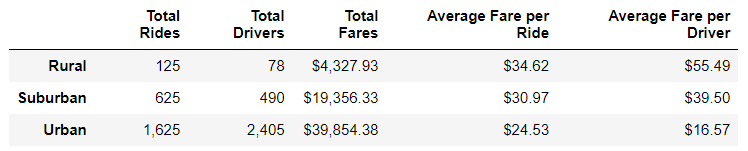
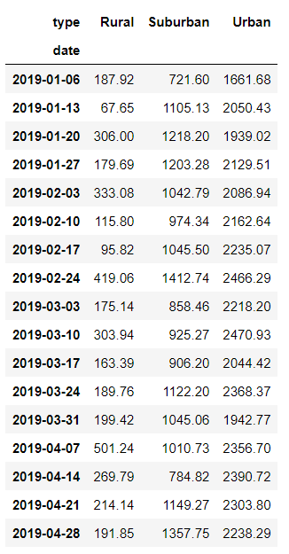
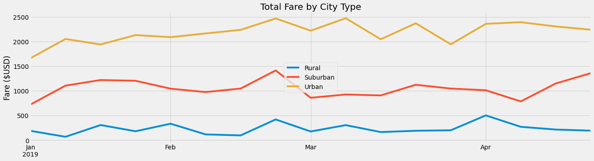

# PyBer Analysis

## Project Overview
- This analysis project provides a visualizatoin of trends in PyBer Company's ride-sharing data.The areas of focus for this project include the following:

    1.Summary table by city type (Urban, Suburban, Rural)
    
    2.Summary table and multiple-line chart of total fares for each city type

##  Results

### 1. Summary table of the ride-sharing data for each city type from January to early May of 2019. 

- Urban cities had the highest number of total rides,total drivers, and total fares.
- Urban cities had the lowest average fare per ride and per driver
- Rural cities had the lowest number of total rides, total drivers, and total fares.
- Rural cities had the highest average fare per ride and per driver.

### 2. Summary table and  a multiple line graph of the total fares (US Dollars) for each city type from January 2019 to April 2019.

- Urban fares maintained the highest fare amount, followed by Suburban at a mid-amount, and Rural cities being the lowest fare amount. 
- Urban, Suburban, and Rural cities experience together an increase in fare amounts near the end of February. Highest total fare amount for Urban and Suburban cities occurred near end of February. 
- Highest total fare amount for Rural cities occurred at beginning of April.
## Recommendations for PyBer
  
  - Possible recommendations for improving disparities for Rural cities:
    - Offering more incentivies to Rural drivers and rural riders 
    - More marketing towards Rural cities
    - Providing charity towards rural cities, which would improve quality of life, and in return, increase their use of PyBer services.

